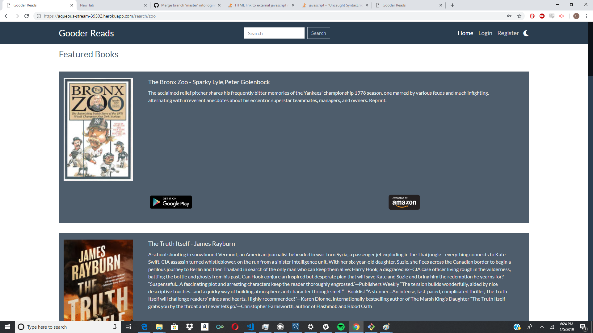
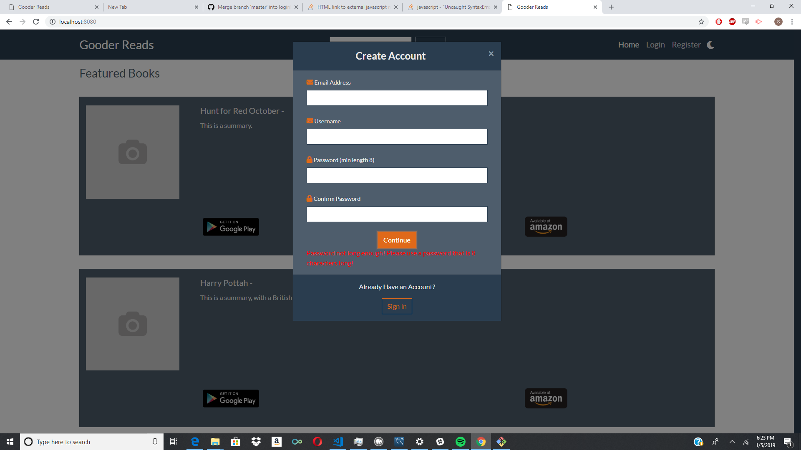
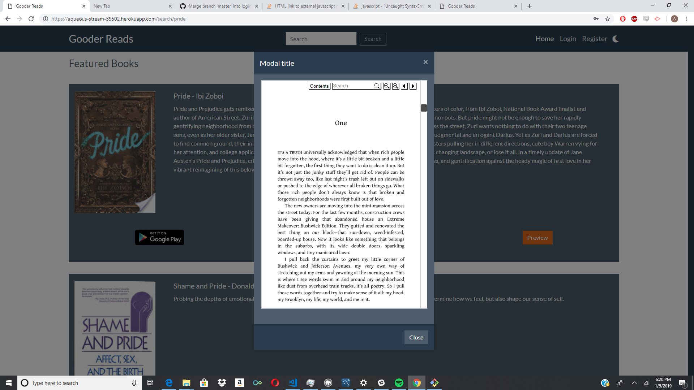
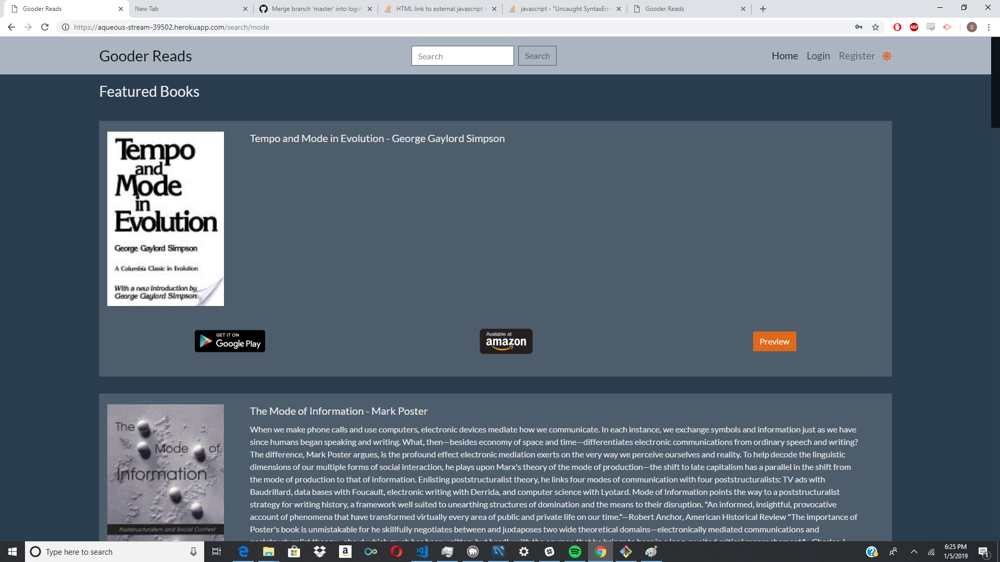

# GooderReads
It's more good.

## About
A parody Project by Shayne Officer, Ryan Brode-Frank, Steve Lucas, Nathan Walker, and Shawn Ard. 

GooderReads was conceived as a project to let us test our knowledge of Object Oriented Programming and Relational Database Usage. 

The application opens with a landing page where users are shown a featured books of the day page. From this users are able to login and register to our site. The registration process allows users to select from over 25 Genres of Books. Once the User has registered and/or logged in they are able to rate books they have already read. The user profile page will feature suggestions catered to the user based on book ratings and reviews given by other users!

## Features
The application has several features with the highlight being a selection of over 250,000 books to choose from.
A preview mode where when available the user is allowed to read the first few pages of a book in addition to having the summary available.
A Link to the books Amazon webpage if the user wishes to Purchase the book.
A Night Mode which changes the theme of the site so the user can browse in bed.
GooderReads also features basic backend encryption to ensure the safety of the users Data. 

## Technologies
Express- MySql- Heroku- bcrypt-nodejs- google-booksAPI- axios-

## Future Development
Future Features will include recommendations based on genres the user is interested in. The ability for the user to review each book with a short summary of their thoughts and a forum page for each book where users can discuss their thoughts with other readers.

Using the [Book Crossing Dataset](http://www2.informatik.uni-freiburg.de/~cziegler/BX/) mined by Cai-Nicolas Ziegler containing 1,149,780 ratings of 271,379 books by 278,858 users.